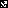

# ArUco Markers

This repository for detecting aruco marker using opencv-python

## Getting Started

These instructions will show you how to generate AruCo marker and detect the position and orientation of the marker


---

## Prerequisites

What things you need to run this codes:
1. python3
2. opencv (cv2) --> [Installation](https://hackmd.io/@ahanjaya/SJaGgKrNr)
3. numpy
4. glob
5. pickle 

Tested on MSI-GP63 (Leopard 8RE):

1. 8th Gen. Intel® Core™ i7 processor
2. GTX 1060 6GB GDDR5 with desktop level performance
3. Memory 16GB DDR4 2666MHz
4. SSD 256 GB
5. Ubuntu 16.04.06 LTS (with ROS Kinetic)
6. Logitech C922 webcam


---
## Table of Contents

[TOC]

---

### Camera calibration

Follow my camera calibration [tutorial](https://github.com/ahanjaya/Calibrate_Camera.git), for acquiring camera matrix and distortion

```
self.mtx  # camera matrix
self.dist # camera distortion
```

---

### Generating Markers

Visit this [link](https://http://chev.me/arucogen/) to generate ArUco marker and print it.

Marker should look like this, example of ArUco 6x6 dict with id 0 & size 1000mm:
<center>
   
</center>

---

### Detecting the Markers

```
python3 aruco_sample.py
```


---

References
---
1. http://chev.me/arucogen/
2. https://github.com/njanirudh/Aruco_Tracker.git
3. https://docs.opencv.org/trunk/d5/dae/tutorial_aruco_detection.html

---
## Appendix and FAQ

:::info
**Find this document incomplete?** Leave a comment!
:::